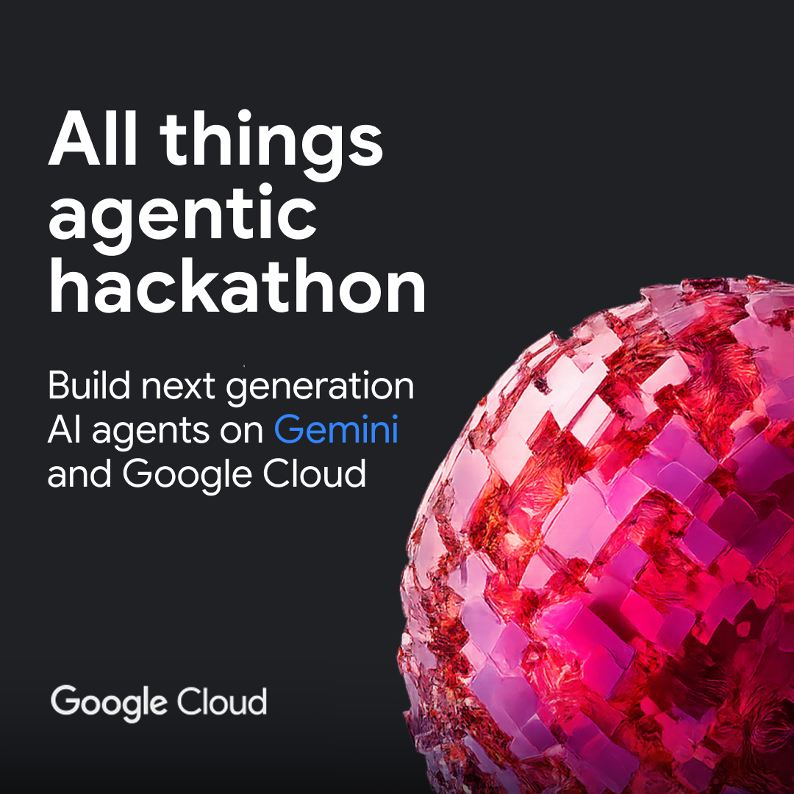
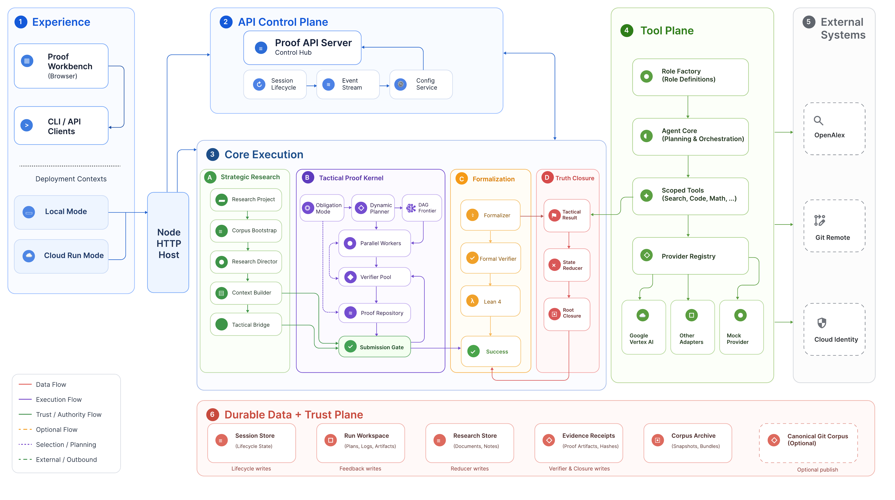
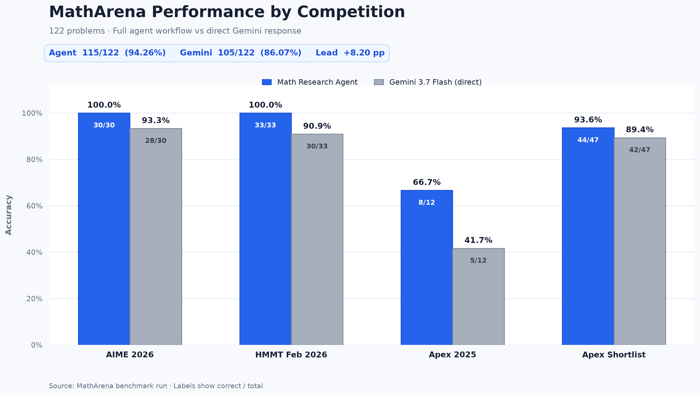
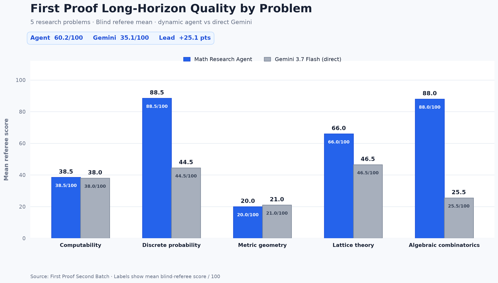

  
  
<strong>Proof-oriented execution for difficult mathematics.</strong> A persistent runtime for planning, verifying, formalizing, and auditing mathematical work.

  

    <a href="#quick-start">Quick start</a> ·
    <a href="#architecture">Architecture</a> ·
    <a href="#api">API</a> ·
    <a href="#development">Development</a>
  

  

    
    
    
  

> Math Research Agent treats a theorem as a durable execution job rather than a single model request. Runtime-owned state, independent verification, formal process gates, and evidence receipts determine what can be accepted.

## Table of contents

Expand

- [Overview](#overview)
- [Hackathon submission](#hackathon-submission)
- [Quick start](#quick-start)
- [Architecture](#architecture)
- [Core capabilities](#core-capabilities)
- [Proof execution model](#proof-execution-model)
- [Effect showcase](#effect-showcase)
- [MathArena benchmark](#matharena-benchmark)
- [First Proof long-horizon benchmark](#first-proof-long-horizon-benchmark)
- [Durability and evidence](#durability-and-evidence)
- [Runtime states](#runtime-states)
- [API](#api)
- [Formal verification](#formal-verification)
- [Long-running research](#long-running-research)
- [Configuration](#configuration)
- [Cloud Run](#cloud-run)
- [Repository layout](#repository-layout)
- [Development](#development)
- [Documentation](#documentation)
- [Design invariants](#design-invariants)
- [License](#license)

## Overview

Math Research Agent is a TypeScript system for persistent mathematical proof execution. It accepts a theorem, creates a session, plans work, dispatches focused tasks, records intermediate artifacts, verifies candidate arguments independently, and exposes the result through an HTTP/SSE API.

The project has two execution scales:

| Scale | Runtime | Purpose |
| --- | --- | --- |
| Tactical | <code>ProofRuntime</code> / <code>ProofWorkflow</code> | Solve and verify a single proof obligation |
| Strategic | <code>ResearchRuntime</code> | Maintain a long-running research project with claims, evidence, routes, checkpoints, and root closure |

The model supplies mathematical work and planning proposals. The runtime owns task dependencies, persistence, recovery, provider boundaries, evidence metadata, and submission gates.

## Hackathon submission

  

This project is submitted as an entry to the [All Things Agentic Hackathon](https://allthingsagentichackathon.devpost.com/). The submission uses Gemini through Google Vertex AI and includes a Google Cloud Run deployment profile for the hosted demonstration.

## Quick start

### Requirements

- Node.js 22 or later
- pnpm 11 or later
- Google Cloud CLI and Vertex AI access for real model calls
- Lean 4, Lake, and the pinned Mathlib environment for local formalization

### Install and run

~~~bash
git clone https://github.com/dongxuelian2/math-research-agent.git
cd math-research-agent

bash scripts/install.sh
bash scripts/start.sh
~~~

The installer runs a frozen pnpm install and builds the TypeScript backend. Open:

- Workbench: [http://127.0.0.1:3080](http://127.0.0.1:3080)
- Proof API: [http://127.0.0.1:43100](http://127.0.0.1:43100)
- Health: [http://127.0.0.1:43100/health](http://127.0.0.1:43100/health)

To run only the proof API:

~~~bash
pnpm start:api
~~~

For Windows, use <code>scripts/install.ps1</code> and <code>scripts/start.ps1</code>.

### Local credentials

The default profile uses Google Vertex AI through <code>@google/genai</code>. Authenticate with Application Default Credentials:

~~~bash
gcloud auth application-default login
~~~

Credential values are read at runtime. Configuration stores environment-variable names, not credential JSON or private-key material.

## Architecture

  

  Click the diagram to open the original PDF reference.

The architecture is organized around six boundaries:

| Layer | Main components | Responsibility |
| --- | --- | --- |
| **Experience** | Proof Workbench, CLI/API clients, local mode, Cloud Run mode | Accept theorem requests and present proof state |
| **API control plane** | Proof API Server, session lifecycle, event stream, ConfigService | Expose stable HTTP resources and configuration snapshots |
| **Core execution** | ResearchRuntime, ProofRuntime, dynamic planner, workers, verifier pool, formalizer, state reducer | Execute proof and research state transitions |
| **Tool plane** | Role Factory, Agent Core, scoped tools, Provider Registry | Construct configured roles and constrain model/tool access |
| **External systems** | OpenAlex, Git remote, Cloud Identity | Literature, optional corpus publication, and cloud authentication |
| **Durable data and trust** | Session Store, Run Workspace, Research Store, evidence receipts, corpus archive | Persist state, artifacts, verification evidence, and controlled projections |

The original reference is available as [PNG](docs/architecture/proof-ai-orchestration-architecture.png) and [PDF](docs/architecture/proof-ai-orchestration-architecture.pdf).

## Core capabilities

| Capability | Implementation |
| --- | --- |
| Dynamic task planning | Planner action protocol with <code>spawn</code>, dependency edges, success criteria, and continuation tasks |
| Ready-frontier execution | Only tasks whose dependencies are complete are dispatched; independent tasks can run concurrently up to <code>maxWorkers</code> |
| Independent verification | Worker results are inspected by a separate verifier pool before candidate submission |
| Proof repository | Candidates, merged feedback, failed routes, and whiteboard state remain available across planning rounds |
| Durable recovery | Sessions, runs, configuration snapshots, step state, and partial outputs survive process restarts |
| Formal process gate | Lean source is checked by the configured <code>lake env lean</code> process before formal acceptance |
| Evidence-aware research | Research tools record artifact reads, searches, references, and trust receipts |
| Provider isolation | Provider adapters are selected by configuration; role definitions do not grant arbitrary tool permissions |
| HTTP/SSE integration | The GUI uses the public API and event stream without importing proof runtime internals |
| Controlled corpus projection | Canonical corpus publishing is a separate, opt-in outbox and reconciliation path |

## Proof execution model

### End-to-end lifecycle

~~~mermaid
flowchart LR
  theorem["Theorem"] --> session["Session"]
  session --> api["Proof API"]
  api --> planner["Planner"]
  planner --> frontier["Ready frontier"]
  frontier --> workers["Parallel workers"]
  workers --> verifiers["Independent verifiers"]
  verifiers --> candidate["Verified candidate"]
  candidate --> submission["Submission gate"]
  submission --> result["Proof result"]
  submission -. "prove_and_formalize" .-> formalizer["Formalizer"]
  formalizer --> lean["lake env lean"]
  lean --> result
  result --> artifacts["Durable artifacts"]
  artifacts --> planner
~~~

### Planner and task graph

The default workflow mode is <code>dynamic</code>. A planner round receives the theorem, whiteboard, repository index, previous outputs, failed routes, budget, and current task graph. It returns typed actions that the runtime validates before execution.

Each task may declare:

- <code>dependsOn</code> — predecessor task IDs that must complete first;
- <code>successCriteria</code> — the local result required from the task;
- <code>continuationOf</code> — the previous task when work is partial or retryable;
- a scope and contribution kind — for example a local lemma, route analysis, or synthesis task.

The runtime computes the ready frontier, runs independent tasks in bounded batches, sends merged worker/verifier feedback into the next planner round, and persists every transition. <code>maxWorkers</code> limits concurrency; it does not decide how a theorem should be decomposed.

<code>legacy</code> mode remains available for compatibility with the fixed Planner/Worker/Verifier workflow.

### Role separation

| Role | Responsibility |
| --- | --- |
| Planner | Select the next proof actions and task graph |
| Worker | Produce a focused mathematical contribution or candidate proof |
| Verifier | Independently check the worker result and report a verdict |
| Synthesizer | Assemble accepted contributions into a final research or proof artifact |
| Formalizer | Produce or repair complete Lean source |
| Research Director | Select strategic research actions and target obligations |
| Corpus Bootstrapper | Import configured mathematical corpus material |
| Secondary Auditor | Re-check final research evidence and closure conditions |

The role factory resolves model profiles and tools from trusted configuration. A task description can state what an agent is for, but it does not itself grant access to tools.

## Effect showcase

The two responses below address the same q-Kneser graph problem. Only representative proof checkpoints are shown; this is an output-quality comparison for one difficult problem, not an aggregate benchmark.

### Selected checkpoints

| Proof checkpoint | Direct response | Structured agent response |
| --- | --- | --- |
| Minimum eigenvalue | Derives the same spectrum and reaches <code>lambda_min = lambda_1</code> through a parity split and a Gaussian-binomial ratio comparison. | Makes the monotonicity checkpoint explicit: <code>f(j) = |lambda_j|</code>, <code>f(j+1) / f(j) = (q^(k-j)-1) / (q^(n-2j)-q^(k-j)) &lt; 1</code>, and <code>lambda_min = -q^(k(k-1)) [n-k-1 choose k-1]_q</code>. |
| Extremal-family uniqueness | Uses a “general position” choice of a subspace and asserts that a weighted sum becomes non-integral. The required existence argument and the contradiction are not established. | Counts <code>W_(L,U)</code>, derives <code>N1 c_L + N2 (1 - c(U+L)) = 0</code>, obtains <code>c_L = 0</code> for <code>L not subset U</code>, and forces <code>F = F_(L0)</code>. |
| Theta and capacity | Uses edge-transitivity to state that an SDP optimizer has the form <code>J + cA</code>, then applies the sandwich bound. The symmetry reduction is stated rather than independently checked. | Writes the same candidate matrix and spectral calculation as a concrete derivation, while the runtime still treats the result as a candidate until verification and the selected formal gate pass. |

### Representative proof steps

The comparison is most visible in the transition from a claimed geometric construction to a checkable counting argument.

#### Direct response: unresolved uniqueness step

~~~text
Choose Y in general position so that no positive-weight point is contained in Y.
Then sum_(L subset Y) c_L is claimed to lie in (0, 1).
This contradicts the {0, 1}-valued indicator.
~~~

The missing step is the construction of such a subspace Y and the proof that the weighted sum has the asserted value.

#### Structured agent response: explicit counting step

~~~text
N1 c_L + N2 (1 - c(U+L)) = 0
c(U+L) = 1
c_L = 0  for L not subset U

support(c) subseteq intersection_(U in F) U
F = F_(L0)
~~~

For the spectrum, the same response also exposes the independent audit trail: <code>f(0) &gt; f(1) &gt; ... &gt; f(k)</code>, followed by <code>lambda_min = lambda_1</code>.

The project preserves this distinction at runtime: a worker result is independently verified, passed through the submission gate, and formalized with <code>lake env lean</code> when the selected proof mode requires it.

## MathArena benchmark

We evaluated Math Research Agent on 122 official MathArena final-answer problems across four categories. The Agent result uses the complete execution workflow: parallel workers, independent verification, and continued repair/recovery until success or a terminal wall. Gemini is the original direct-response baseline on the same problems.

  

| Category | Math Research Agent | Gemini 3.7 Flash direct |
| --- | ---: | ---: |
| AIME 2026 | **30/30 (100.0%)** | 28/30 (93.3%) |
| HMMT Feb 2026 | **33/33 (100.0%)** | 30/33 (90.9%) |
| Apex 2025 | **8/12 (66.7%)** | 5/12 (41.7%) |
| Apex Shortlist | **44/47 (93.6%)** | 42/47 (89.4%) |
| **Overall** | **115/122 (94.26%)** | **105/122 (86.07%)** |

The complete workflow gives the Agent an **8.20 percentage-point overall lead**. The strongest separation appears on Apex 2025, where the Agent solves 8 of 12 problems versus 5 of 12 for direct Gemini; the Agent also reaches 100% on both AIME 2026 and HMMT Feb 2026.

Benchmark artifacts:

- [Performance chart (PNG)](benchmarks/matharena-20260831/charts/matharena-performance-comparison.png) · [editable SVG](benchmarks/matharena-20260831/charts/matharena-performance-comparison.svg)
- [Official score summary](benchmarks/matharena-20260831/summary-official.json)
- [Retry and recovery audit](benchmarks/matharena-20260831-gate-retries/status.json)
- [Benchmark runner](backend/scripts/matharena-benchmark.mjs) · [chart generator](backend/scripts/matharena-comparison-chart.py)

## First Proof long-horizon benchmark

To measure proof planning rather than only final-answer accuracy, we ran five research-level problems from the [First Proof Second Batch](https://github.com/1stproof/batch-2). Each problem was solved by a one-shot Gemini baseline and by the dynamic planner/worker/verifier workflow. Two reversed-order blind referee passes scored correctness, plan execution, critical-step completeness, useful partial progress, and exposition on a 100-point scale.

  

| Problem field | Math Research Agent | Gemini 3.7 Flash direct |
| --- | ---: | ---: |
| Computability | 38.5 / 100 | 38.0 / 100 |
| Discrete probability | **88.5 / 100** | 44.5 / 100 |
| Metric geometry | 20.0 / 100 | 21.0 / 100 |
| Lattice theory | **66.0 / 100** | 46.5 / 100 |
| Algebraic combinatorics | **88.0 / 100** | 25.5 / 100 |
| **Mean** | **60.2 / 100** | **35.1 / 100** |

The agent wins **8/10** blinded pairwise comparisons, with a +25.1-point mean lead. The result is primarily a proof-quality signal: the strongest agent submissions preserve a multi-stage plan, verify boundary cases, and stop at a precise open obstruction instead of forcing a false classification. A larger workflow budget does not guarantee correctness—the metric-geometry submissions are both rejected for a central Stokes/coarea gap.

Benchmark artifacts:

- [Performance chart (PNG)](docs/assets/first-proof-long-horizon-performance.png) · [editable SVG](docs/assets/first-proof-long-horizon-performance.svg) · [chart data](docs/assets/first-proof-long-horizon-performance-data.json)
- [Detailed report](benchmarks/first-proof-long-horizon-20260831/REPORT.md) · [review summary](benchmarks/first-proof-long-horizon-20260831/review-summary.json)
- [Benchmark runner](backend/scripts/first-proof-long-horizon-benchmark.mjs) · [recovery tool](backend/scripts/first-proof-long-horizon-recover.mjs) · [blind referee](backend/scripts/first-proof-long-horizon-review.mjs) · [chart generator](backend/scripts/first-proof-long-horizon-comparison-chart.py)

## Durability and evidence

### Proof-run workspace

Each proof run has its own workspace under <code>.math-agent/proof-runs/</code>:

~~~text
.math-agent/
├── sessions/
│   └── <session-id>.jsonl
├── proof-runs/
│   └── <session-id>/<run-id>/
│       ├── THEOREM.md
│       ├── THEOREM.lean
│       ├── WHITEBOARD.md
│       ├── run_config.json
│       ├── state.json
│       ├── PROOF.md
│       ├── PROOF.lean
│       ├── repo/
│       └── steps/
│           └── step_NNN/
│               ├── planner_context.json
│               ├── planner_response.txt
│               ├── planner_plan.json
│               ├── actions.json
│               ├── worker_*_output.md
│               ├── verifier_*.json
│               └── step_status.json
└── research/
    └── <project-id>/
        ├── state.json
        └── artifacts/
~~~

The session JSONL contains typed lifecycle entries. The run workspace contains the full theorem, plans, prompts, outputs, verifier records, whiteboard, repository, and formal attempts needed for recovery and audit.

### Evidence and authority

Research artifacts carry content hashes, provenance, references, and authority classifications. Tool use is recorded separately from the mathematical result. A worker may discover or read evidence, but a claim becomes authoritative only through the configured verification, reduction, and closure path.

The corpus archive is a projection layer. Raw planner, worker, verifier, scratch, candidate, and audit outputs are not published directly to the canonical Git corpus.

## Runtime states

| State | Meaning |
| --- | --- |
| <code>CANDIDATE_READY</code> | A candidate passed independent verification and is waiting for the submission gate |
| <code>PARTIAL</code> | A budget or step limit was reached while resumable work remains |
| <code>PROVED</code> | The configured submission path passed; formalization also passed when required by the selected mode |
| <code>FAILED</code> | The workflow ended without an accepted route |
| <code>BLOCKED_FORMAL</code> | The formalization project or Lean process is unavailable |
| <code>BLOCKED_PROVIDER</code> | A model, literature, or remote tool provider is unavailable |
| <code>CANCELLED</code> | The caller cancelled the run |

<code>CANDIDATE_READY</code> is not a final proof state. A model label, a generated file, or a successful worker response is not sufficient for <code>PROVED</code>.

## API

### Health and configuration

| Method | Endpoint | Purpose |
| --- | --- | --- |
| <code>GET</code> | <code>/health</code> | Runtime and deployment health evidence |
| <code>GET</code> | <code>/v1/config</code> | Read the effective configuration |
| <code>GET</code> | <code>/v1/config/document</code> | Read the editable TOML document |
| <code>PUT</code> | <code>/v1/config</code> | Apply a revision-checked configuration update |
| <code>GET</code> | <code>/v1/config/models</code> | Read the redacted model catalog |

### Proof resources

| Method | Endpoint | Purpose |
| --- | --- | --- |
| <code>POST</code> | <code>/v1/sessions</code> | Create a session |
| <code>GET</code> | <code>/v1/sessions</code> | List sessions |
| <code>GET</code> | <code>/v1/sessions/:sessionId</code> | Read session state |
| <code>POST</code> | <code>/v1/sessions/:sessionId/theorem</code> | Submit a theorem |
| <code>POST</code> | <code>/v1/sessions/:sessionId/proof-runs</code> | Start a proof run |
| <code>GET</code> | <code>/v1/sessions/:sessionId/proof-runs</code> | List runs for a session |
| <code>GET</code> | <code>/v1/sessions/:sessionId/proof-runs/:runId</code> | Read run state |
| <code>GET</code> | <code>/v1/sessions/:sessionId/proof-runs/:runId/events</code> | Stream typed events over SSE |
| <code>GET</code> | <code>/v1/sessions/:sessionId/proof-runs/:runId/result</code> | Read the final result |
| <code>POST</code> | <code>/v1/sessions/:sessionId/proof-runs/:runId/cancel</code> | Request cancellation |

### Minimal API flow

~~~bash
API_URL=http://127.0.0.1:43100
SESSION_ID=demo-session

curl -fsS -X POST "$API_URL/v1/sessions" \
  -H 'content-type: application/json' \
  -d '{"sessionId":"demo-session"}'

curl -fsS -X POST "$API_URL/v1/sessions/$SESSION_ID/theorem" \
  -H 'content-type: application/json' \
  -d '{"theorem":"For every integer n >= 1, 1 + 3 + ... + (2n - 1) = n^2."}'

curl -fsS -X POST "$API_URL/v1/sessions/$SESSION_ID/proof-runs" \
  -H 'content-type: application/json' \
  -d '{"mode":"prove"}'
~~~

Copy the returned <code>runId</code> and inspect the stream, state, and result:

~~~bash
RUN_ID=<run-id>

curl -N "$API_URL/v1/sessions/$SESSION_ID/proof-runs/$RUN_ID/events"
curl -fsS "$API_URL/v1/sessions/$SESSION_ID/proof-runs/$RUN_ID"
curl -fsS "$API_URL/v1/sessions/$SESSION_ID/proof-runs/$RUN_ID/result"
~~~

## Formal verification

### Proof-run modes

| Mode | Required output |
| --- | --- |
| <code>prove</code> | A candidate that passes the informal submission path |
| <code>formalize_only</code> | A process-verified <code>PROOF.lean</code> |
| <code>prove_and_formalize</code> | An accepted informal proof and a process-verified Lean proof |

The full local profile enables formalization. A Formalizer may generate a Lean declaration and proof, or preserve a caller-provided exact declaration and fill its proof. The result is stored as an untrusted draft first; the configured Lean process is the acceptance authority.

The runtime uses <code>lake env lean</code> in the session project. Compilation failure is persisted as a formal attempt and routed back into the workflow for repair. Proof-local <code>sorry</code>, <code>admit</code>, <code>axiom</code>, <code>constant</code>, and <code>opaque</code> escapes are rejected.

Run the repository formalization project directly:

~~~bash
cd formalization
lake env lean MathResearchAgentFormalization.lean
~~~

See [<code>formalization/README.md</code>](formalization/README.md) and [<code>docs/PROOF_WORKFLOW.md</code>](docs/PROOF_WORKFLOW.md) for the complete formalization contract.

## Long-running research

<code>ResearchRuntime</code> is the strategic layer above tactical proof runs:

~~~text
Research project
  -> corpus bootstrap
  -> research director
  -> tactical directive
  -> ProofRuntime
  -> evidence receipts
  -> ResearchStateReducer
  -> root readiness
  -> synthesis and independent audit
~~~

Research projects persist:

- root objective contracts and claims with revision history;
- dependencies, support edges, routes, coverage, and open obligations;
- corpus documents and bootstrap reports;
- execution plans, task attempts, artifacts, and evidence receipts;
- trust receipts, authority receipts, checkpoints, and final-proof history;
- formalization status and root-closure readiness.

Core research routes include:

| Method | Endpoint | Purpose |
| --- | --- | --- |
| <code>POST</code> | <code>/v1/research/projects</code> | Create a research project |
| <code>GET</code> | <code>/v1/research/projects</code> | List research projects |
| <code>POST</code> | <code>/v1/research/projects/:projectId/root</code> | Set the root objective contract |
| <code>POST</code> | <code>/v1/research/projects/:projectId/start</code> | Start a research campaign |
| <code>POST</code> | <code>/v1/research/projects/:projectId/resume</code> | Resume a campaign |
| <code>GET</code> | <code>/v1/research/projects/:projectId/frontier</code> | Read the current research frontier |
| <code>GET</code> | <code>/v1/research/projects/:projectId/root-readiness</code> | Check root closure readiness |
| <code>POST</code> | <code>/v1/research/projects/:projectId/synthesis</code> | Run root synthesis and audit |
| <code>GET</code> | <code>/v1/research/projects/:projectId/audit</code> | Validate persisted research invariants |

Corpus publishing is disabled by default. Its outbox, reconciliation, retry, and optional Git projection are controlled independently from research truth.

## Configuration

Configuration is TOML-based and revisioned. An active proof run keeps the configuration snapshot created at run start; later edits affect subsequent runs.

| Profile | Use | Formalization |
| --- | --- | --- |
| [<code>configs/math-agent.toml</code>](configs/math-agent.toml) | Full local runtime | Enabled; creates session Lean projects |
| [<code>configs/math-agent-cloud-run.toml</code>](configs/math-agent-cloud-run.toml) | Lightweight Cloud Run demo | Disabled; uses non-formal <code>prove</code> mode |

The configuration controls:

- runtime host, web/API ports, and data directory;
- proof mode, workflow mode, worker concurrency, and step limits;
- formalization, literature, research, budget, and corpus policies;
- scoped tool capabilities and allowed executables;
- provider profiles, model parameters, and role mappings;
- corpus roots, import authority, archive behavior, and optional publication.

The provider registry includes Google Vertex AI, Google, OpenAI-compatible, OpenRouter, DeepSeek, Anthropic, Codex CLI, and Mock adapters. The default profile uses Google Vertex AI with <code>gemini-3.7-flash</code>.

## Cloud Run

The Cloud Run deployment runs the GUI and proof API in one service and exposes them from one <code>run.app</code> origin. The service routes <code>/health</code> and <code>/v1/...</code> to the in-process API and serves the Workbench from the same port.

~~~bash
export CLOUD_RUN_PROJECT="your-gcp-project-id"
export CLOUD_RUN_REGION="us-central1"
export GOOGLE_CLOUD_LOCATION="global"
bash scripts/deploy-cloud-run.sh
~~~

The deployment uses [<code>docs/CLOUD_RUN_DEMO.md</code>](docs/CLOUD_RUN_DEMO.md). Cloud Run storage is temporary, so this profile is for a bounded demonstration rather than a durable multi-instance research archive.

## Repository layout

~~~text
.
├── apps/
│   └── proof-workbench/       Browser Workbench and thin static server
├── backend/
│   ├── src/agent/             Agent core and role execution
│   ├── src/api/               HTTP API and resource routes
│   ├── src/proof/             ProofRuntime, planning, verification, and formalization
│   ├── src/providers/         Provider adapters and registry
│   └── src/research/          ResearchRuntime, evidence, closure, and corpus
├── configs/                   Local and Cloud Run TOML profiles
├── docs/                      Workflow, runtime, deployment, and architecture docs
├── formalization/             Lean 4/Lake project
├── projects/                  Local example and runtime project data
└── scripts/                   Install, start, deploy, and repository utilities
~~~

## Development

Install dependencies and run the main checks:

~~~bash
pnpm install --frozen-lockfile
pnpm run typecheck
pnpm run test:proof
pnpm run build
~~~

Useful commands:

| Command | Purpose |
| --- | --- |
| <code>pnpm run build:proof</code> | Compile the backend |
| <code>pnpm run build:gui</code> | Check the Workbench and server entrypoints |
| <code>pnpm run typecheck</code> | Run the backend TypeScript typecheck |
| <code>pnpm run test:proof</code> | Build and run backend proof/research tests |
| <code>pnpm run corpus -- status --project &lt;project-id&gt;</code> | Inspect the corpus archive outbox |
| <code>pnpm start:api</code> | Start only the proof API |
| <code>pnpm start</code> | Start the local Workbench and API |

The backend tests cover configuration parsing, role and model validation, provider behavior, persistence, proof planning, dynamic dependencies, continuations, formal gates, HTTP/SSE resources, research reduction, authority receipts, and restart recovery.

GitHub Actions is currently disabled for this repository; there are no active repository workflows.

## Documentation

| Document | Scope |
| --- | --- |
| [<code>docs/PROOF_WORKFLOW.md</code>](docs/PROOF_WORKFLOW.md) | Tactical proof workflow, planner protocol, artifacts, states, and formal gate |
| [<code>docs/WORKFLOW_RUNTIME_V2.md</code>](docs/WORKFLOW_RUNTIME_V2.md) | Dynamic DAG execution, ready frontiers, dependencies, and recovery |
| [<code>docs/MATHEMATICAL_RESEARCH_RUNTIME.md</code>](docs/MATHEMATICAL_RESEARCH_RUNTIME.md) | Strategic research runtime and project lifecycle |
| [<code>docs/MRR_V1_INVARIANTS.md</code>](docs/MRR_V1_INVARIANTS.md) | Research truth, evidence, authority, and closure invariants |
| [<code>docs/CORPUS_ARCHIVE_PROTOCOL.md</code>](docs/CORPUS_ARCHIVE_PROTOCOL.md) | Corpus outbox, reconciliation, and publication policy |
| [<code>apps/proof-workbench/README.md</code>](apps/proof-workbench/README.md) | Browser Workbench boundary and local serving model |
| [<code>formalization/README.md</code>](formalization/README.md) | Lean toolchain and process verification |
| [<code>docs/CLOUD_RUN_DEMO.md</code>](docs/CLOUD_RUN_DEMO.md) | Cloud Run deployment and runtime evidence |

## Design invariants

1. Model prose is input to the runtime, not the authority for truth.
2. A worker result must pass independent verification before candidate submission.
3. <code>PROVED</code> is emitted only after the configured submission and formal gates pass.
4. Provider failure, formal-tool failure, and mathematical failure remain distinct states.
5. A resumed run uses its persisted configuration and artifacts rather than silently mixing current settings into old state.
6. Research claims require evidence and authority receipts; a verified subtask is not automatically a proof of the root objective.
7. Corpus publication is an explicit projection and cannot rewrite research truth when Git or remote publication fails.

## License

Math Research Agent is released under the [MIT License](LICENSE).
