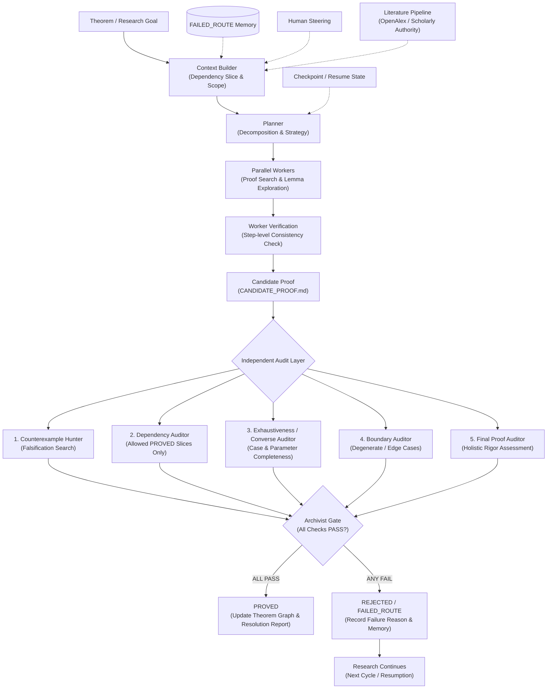

# Math Research Agent

> **An agentic multi-stage reasoning and verification system for long-horizon mathematical research.**  
> **面向长期复杂自然语言数学证明与自动化验证的多智能体架构系统。**

---

## English Summary

**Math Research Agent** is a specialized multi-agent system designed for long-horizon mathematical research and discovery. Instead of relying on a single large language model to generate unchecked proofs end-to-end, it strictly decouples **proof generation** from **independent multi-role verification**. The system maintains formal theorem dependency graphs, isolates allowed background knowledge, captures failed strategies in a structured `FAILED_ROUTE` memory, and only promotes candidate proofs to `PROVED` status when an exhaustive five-stage **Archivist Audit Gate** passes unconditionally.

---

## What It Does

- **Long-Horizon Research Orchestration**: Coordinates hierarchical agent teams (Planner, Parallel Workers, Step Verifiers, Specialist Auditors, Archivist) to tackle deep mathematical problems step-by-step.
- **Strict Dependency & Scope Gating**: Enforces mathematical dependency slices; propositions cannot cite unproved conjectures, unverified lemmas, or cyclic reasoning.
- **Fail-Fast `FAILED_ROUTE` Memory**: Explicitly records why particular proof avenues failed, preventing agents from falling into infinite loops or repetitive dead ends.
- **Independent Multi-Auditor Gate**: Before any candidate proof is accepted, it must survive five independent specialist audits (Counterexample Hunter, Dependency Auditor, Exhaustiveness/Converse Auditor, Boundary Auditor, Final Proof Auditor).
- **Asynchronous Literature Authority**: Integrates scholarly metadata and authoritative literature checks (OpenAlex, PubMed/Europe PMC) for external lemma verification.
- **Durable Checkpointing & Resumption**: Checkpoints execution state at every stage, allowing runs to be paused, resumed, and inspected across sessions.

---

## Why This Architecture

Standard single-agent LLM systems frequently hallucinate subtle mathematical flaws, gloss over degenerate boundary cases, invent false lemmas, or circular dependencies. In rigorous mathematics, an unverified candidate proof is not a theorem.

Math Research Agent solves this by:
1. **Separation of Concerns**: Provers propose, but dedicated adversarial auditors verify.
2. **Deterministic State Machine**: A candidate proof is never `PROVED` until the Archivist Gate verifies all specialist audit certificates.
3. **Reproducibility & Safety**: Zero-cost mocked pipelines enable full deterministic verification of the state machine and audit gate without API keys.

---

## Architecture



---

## Quick Start

### 1. Clone & Bootstrap

```powershell
git clone https://github.com/dongxuelian2/math-research-agent.git
cd math-research-agent

# Bootstrap Python virtual environment and dependencies (Python >= 3.10 required)
.\scripts\bootstrap.ps1
```

### 2. Run Deterministic Test Suite

```powershell
.\.venv\Scripts\python.exe -m pytest -q openprover/tests/math_research
```

### 3. Check Zero-Cost Demo Status

```powershell
.\run_math_agent.ps1 -Command status -Project demo
.\run_math_agent.ps1 -Command status -Project demo -Target demo-odd-sum
```

---

## Zero-Cost Demo vs Real Provider Runs

### Mock Demonstration (Zero Cost, No API Key)
- Located in `projects/demo`.
- Demonstrates complete state-machine lifecycle, checkpointing, candidate proof generation, and five-stage audit gate validation for a sample theorem (`demo-odd-sum`).
- Target status is recorded as `PROVED` with `proof_type = "MOCKED_DEMO"`.
- The mock backend is hard-gated: it **cannot** promote non-demo production theorems to `PROVED`.

### Real Provider Runs (Requires Configured Credentials)
- Production theorems reside in user workspaces (e.g. `projects/main`).
- Config-driven model routing (`configs/models.*.json`).
- Supports official OpenAI Responses API (`OPENAI_API_KEY`), official OpenAI Codex CLI (`codex login`), Claude CLI, Mistral, GLM, OpenRouter, and local OpenAI-compatible backends.

---

## Hackathon / Gemini Integration Status

> **Google All Things Agentic Hackathon Status: Planned / Next Phase Baseline.**

- **Current Repository State**: This public release establishes the validated, reproducible multi-agent mathematical research harness, state machine, and audit kernel.
- **Gemini Provider Phase**: A dedicated native Google Gemini provider (`gemini-2.0-flash`, `gemini-2.5-pro` / Google GenAI SDK) will be integrated in the upcoming hackathon integration phase.
- The environment configuration template `.env.example` already provisions `GEMINI_API_KEY` in anticipation of the upcoming integration.

---

## Providers & Model Routing

Model configurations are decoupled from Python code. Configurations reside in `configs/`:

- `configs/models.mock.json`: Deterministic local mock backend for zero-cost testing.
- `configs/models.openai.example.json`: Official OpenAI Responses API adapter for `gpt-5.6-sol`.
- `configs/models.codex.example.json`: Subprocess-isolated Codex CLI adapter using saved ChatGPT/Codex login.
- `configs/models.heterogeneous.example.json`: Role-specialized routing (different models/temperatures for Planner, Workers, and Auditors).
- `configs/models.claude.example.json`: Claude CLI integration.
- `configs/models.local.example.json`: Local vLLM or OpenAI-compatible inference server.

To customize for local production runs, copy an example to `configs/models.local.json` (`*.local.json` is ignored by Git):
```powershell
Copy-Item .\configs\models.codex.example.json .\configs\models.local.json
```

---

## Dry-Run & Provider Smoke Testing

Before initiating multi-call proving runs, always verify configuration using read-only dry-runs:

```powershell
# Dry-run context and role configuration without making API requests
.\run_math_agent.ps1 -Command run -Project demo -Target demo-odd-sum -WorkerCount 1 -Config configs\models.codex.example.json -DryRun

# Single-call provider health check (forces max_retries=0)
.\run_math_agent.ps1 -Command provider-smoke -Config configs\models.codex.example.json -Role auditor -Expect CODEX_CLI_PROVIDER_OK
```

---

## Human Steering & Campaign Management

```powershell
# Freeze a branch from automated research
.\.venv\Scripts\python.exe -m openprover.math_research steer --project projects\main --freeze-branch old-branch

# Prohibit a failed strategic route
.\.venv\Scripts\python.exe -m openprover.math_research steer --project projects\main --prohibit-route naive-congruence

# Register a structured failed route
.\.venv\Scripts\python.exe -m openprover.math_research failed-route `
  --project projects\main `
  --id valuation-route-v1 --strategy valuation --target my-target `
  --obtained "Controlled v_p of the first factor" `
  --failure-point "Second factor remains uncontrolled" `
  --insufficiency "No coprimality lemma" `
  --recovery-conditions "Resume if lemma-coprime becomes PROVED" `
  --theorems my-target
```

---

## Verification Model & Audit Gates

Every candidate proof (`CANDIDATE_PROOF.md`) produced by parallel worker agents must satisfy all boolean criteria in `gate.json`:

1. **Forward Implication**: Logical soundness of the core deduction.
2. **Converse / Reconstruction**: Bidirectional proof validation where applicable.
3. **Exhaustive Cases**: Complete partition and coverage of mathematical cases.
4. **Parameter Ranges**: Validity over all stated variable domains.
5. **Boundary & Degenerate Cases**: Zero, empty, infinite, or extreme configurations.
6. **Strict Dependency Graph**: Only strictly `PROVED` dependencies; zero cycles.
7. **Counterexample Resistance**: Passed adversarial falsification search.
8. **Specialist & Final Proof Auditor Consensus**: Unanimous auditor approval.

---

## Third-Party Attribution & Licensing

- **Project License**: [MIT License](LICENSE) (c) 2026 Math Research Agent Authors and Contributors.
- **Base Engine Attribution**: OpenProver (c) 2026 Matěj Kripner (MIT License). See [`THIRD_PARTY_NOTICES.md`](THIRD_PARTY_NOTICES.md) and [`openprover/LICENSE`](openprover/LICENSE).

---

## Documentation Index

- [`docs/ARCHITECTURE.md`](docs/ARCHITECTURE.md): System architecture and composition layer design.
- [`docs/CODEX_HANDOFF.md`](docs/CODEX_HANDOFF.md): Engineering handoff notes, invariants, and provider details.
- [`docs/ENVIRONMENT_AUDIT.md`](docs/ENVIRONMENT_AUDIT.md): Platform compatibility and environment audit log.
- [`openprover/docs/TRUST_KERNEL.md`](openprover/docs/TRUST_KERNEL.md): Three-layer trust kernel and hard state machine specifications.
- [`openprover/docs/LONG_HORIZON_CAMPAIGNS.md`](openprover/docs/LONG_HORIZON_CAMPAIGNS.md): Campaign lifecycle, DAG scheduler, and checkpoint protocol.
- [`openprover/docs/HETEROGENEOUS_ROUTING_AND_LITERATURE.md`](openprover/docs/HETEROGENEOUS_ROUTING_AND_LITERATURE.md): Literature pipeline and scholarly authority integration.
