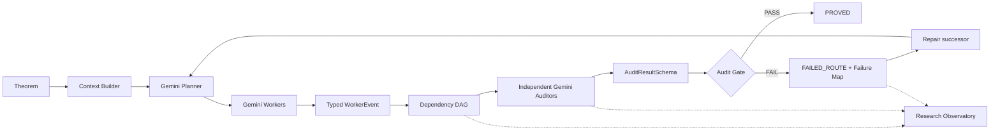

# Math Research Agent Architecture

## Product boundary

The product is Gemini-native. The research layer owns routing, typed control
protocols, durable campaign artifacts, and the Observatory. The proving core
is treated as an execution engine behind one public policy hook.



## Module boundaries

| Module | Owns |
| --- | --- |
| `schemas.py` | Pydantic v2 contracts for all state-affecting provider output |
| `gemini_provider.py` | Gemini Developer API and Vertex Gemini transport, retries, usage, archives |
| `routing.py` | role/tier resolution, fresh-context auditor routing, call lineage |
| `candidate_engine.py` | candidate execution and the narrow boundary into the core engine |
| `audit_coordinator.py` | specialist audits, deterministic dependency report, final gate |
| `pipeline_primitives.py` | resource budget, task context, immutable pipeline state primitives |
| `pipelines.py` | DAG dispatch and asynchronous runtime only |
| `openprover_adapter.py` | `ResearchPolicy` callbacks and typed Worker sidecar bridge |
| `showcase_demo.py` | deterministic hidden-defect → repair replay |
| `observatory.py` | dependency-free HTTP API and Web UI |

The former orchestration God Object is now a lifecycle shell. Candidate
execution and audit coordination do not share private methods with it. The
upstream `Prover` receives `research_policy`; it is not subclassed by the
research layer.

## Trust boundary

```text
Gemini response
      ↓ native responseSchema / application/json
Pydantic validator
      ↓
typed AuditResult / PipelineResult / LiteratureResult
      ↓
deterministic state machine
      ↓
durable gate + event artifacts
```

`parse_structured_response()` parses the entire response as one JSON document.
It never searches for braces, strips prose, accepts Markdown fences, or maps
alternate spellings. A missing or malformed `WorkerEventSchema` sidecar is an
error event; it cannot be interpreted as progress or failure from transcript
text.

## Heterogeneous Gemini routing

Heterogeneous means role-specialized Gemini routes and isolated call lineage:

- strategic planning and final review use the Pro route;
- constructive search and adversarial counterexample work use the Pro route;
- routine checks and literature discovery use the Flash route;
- the independent auditor receives a fresh context and has no shared
  conversation with the candidate generator;
- formalization has an explicit tool-enabled role.

The configuration is declarative in
`configs/models.gemini.example.json`. No role silently falls back to an
implicit provider.

## Durable repair loop

Every failed candidate leaves immutable evidence:

1. the candidate and typed audit documents are archived under a run;
2. `FAILURE_MAP.json` records exact rejected claims and repair suggestions;
3. `failed_routes.json` records the route at project level;
4. a successor run links `parent_run_id` and writes `REPAIR_CONTEXT.md`;
5. the repaired candidate passes the same audit gate before `PROVED`.

The Observatory reads those files directly. It does not infer status from
logs or prose.

## Formal lane and provenance

The UI exposes `formal_status.json` for the optional path:

```text
natural-language candidate
        ↓
formalization_agent
        ↓
Lean tool call
        ↓
compiler certificate
        ↓
trust kernel
```

The showcase labels this lane `PENDING_FORMALIZATION`; it does not claim a
certificate that was not run. Provenance entries carry a SHA-256 digest and a
registry identifier, so a reviewer can open the exact source artifact.

The optional formalization command runs the dedicated formalization_agent
route, exposes Gemini function declarations for Lean, and persists
formalization/formal_status.json. Only an observed successful lean_verify
tool result can produce VERIFIED; a model-only claim remains
PENDING_FORMALIZATION.

## Runtime

The supported initialization path is Bash plus `uv`:

```bash
bash scripts/bootstrap.sh
```

The script syncs `openprover/pyproject.toml`, generates the local replay, and
starts `python -m openprover.math_research observatory`.
