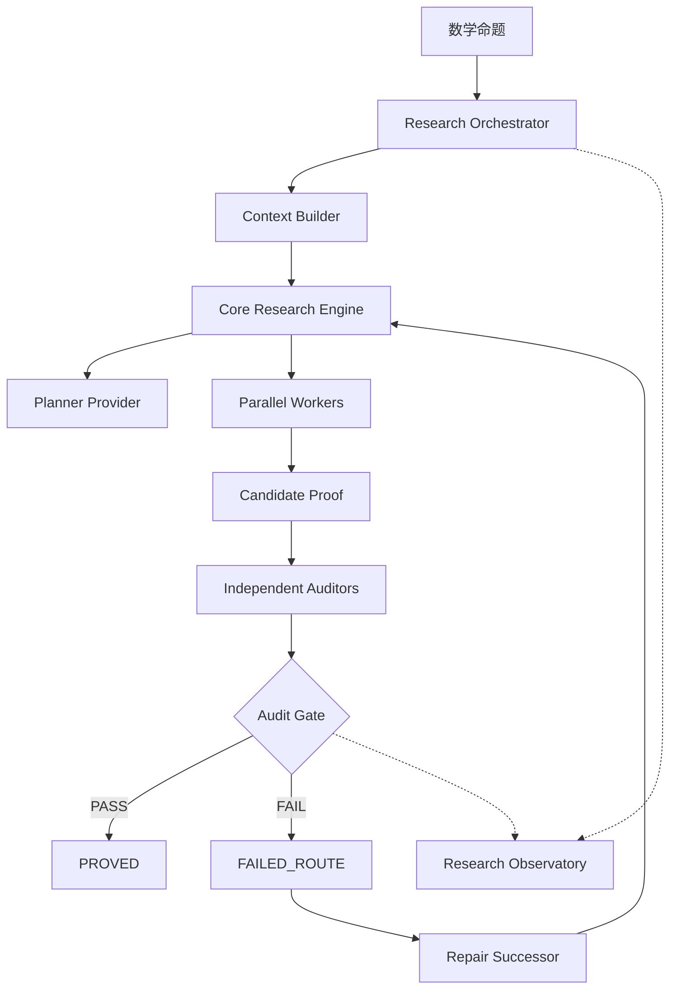

# Math Research Agent 架构

## 分层



## 代码边界

| 层 | 目录 | 职责 |
| --- | --- | --- |
| Core | `src/math_research_agent/core/` | 自研 planner/worker/verifier loop、预算、知识条目读写、`MRA_ACTION` 协议和提交前范围阻断 |
| Research | `src/math_research_agent/research/` | 项目模型、上下文切片、Provider 路由、审计协调、状态机、失败路线、SQLite/WAL 运行时、Observatory |
| Providers | `src/math_research_agent/research/providers.py`、`research/*_provider.py` 与 `providers/responses.py` | Gemini、Vertex Gemini、官方 OpenAI Responses、任意 OpenAI Responses 兼容端点、Codex CLI、Mock 适配及调用归档 |
| Formal | `src/math_research_agent/formal/` | Lean 工具桥接与 theorem declaration 完整性校验 |

`CandidateEngine` 只负责把研究运行参数交给 `core.ResearchEngine`，不再依赖外部 proving engine，也不通过私有控制循环耦合审计层。

## 信任边界

```text
Provider response
      ↓
完整 JSON / Pydantic 校验
      ↓
Candidate + typed audit artifacts
      ↓
确定性状态机与 Audit Gate
      ↓
PROVED 或 FAILED_ROUTE
```

候选生成层只能产生 `CANDIDATE_PROOF`。只有独立审计证据满足门槛时，Archivist 状态转换才可以写入 `PROVED`。

## 多模型接入契约

Responses API 兼容模型统一经过 `ResponsesRequest` 生成 `responses.create(**payload)` 请求。模型名不是代码枚举，路由配置可以直接指定新模型；需要自定义服务时只增加 `provider: "openai_compatible"`、`base_url`（或 `base_url_env`）和密钥环境变量，不需要新增 Python provider。

```text
role route
   ↓
ResponsesRequest
   ↓
official OpenAI / OpenAI-compatible /v1/responses
   ↓
normalized result: result + tool_calls + usage + finish_reason
   ↓
audit and trust kernel
```

## 持久化工件

一次运行的主要工件位于 `projects/<name>/runs/<run-id>/`：

- `context/`：命题、依赖和研究指令的上下文切片；
- `engine/`：自研内核的 planner、worker、verifier 和知识条目；
- `CANDIDATE_PROOF.md`：待审计候选；
- `audits/`：独立审计结果与 gate；
- `FAILURE_MAP.json` / `failed_routes.json`：失败路线和修复上下文；
- `formalization/formal_status.json`：可选 Lean 形式化状态。

项目级恢复和导入还使用项目根目录的持久化工件：

- `timeline.jsonl`：UI、流水线、文件整理和项目恢复的统一追加式轨迹；
- `inbox/manifest.json` 与 `inbox/`：原始导入文件、哈希和处理状态；
- `work/imported/`：从 Markdown、文本、TeX 或 PDF 提取出的项目工作文件和分析清单。

导入材料默认是未验证上下文，只有经过正常依赖、证明和审计门，才可能影响定理状态。

Observatory 直接读取这些工件，不从日志文本猜测项目状态。
